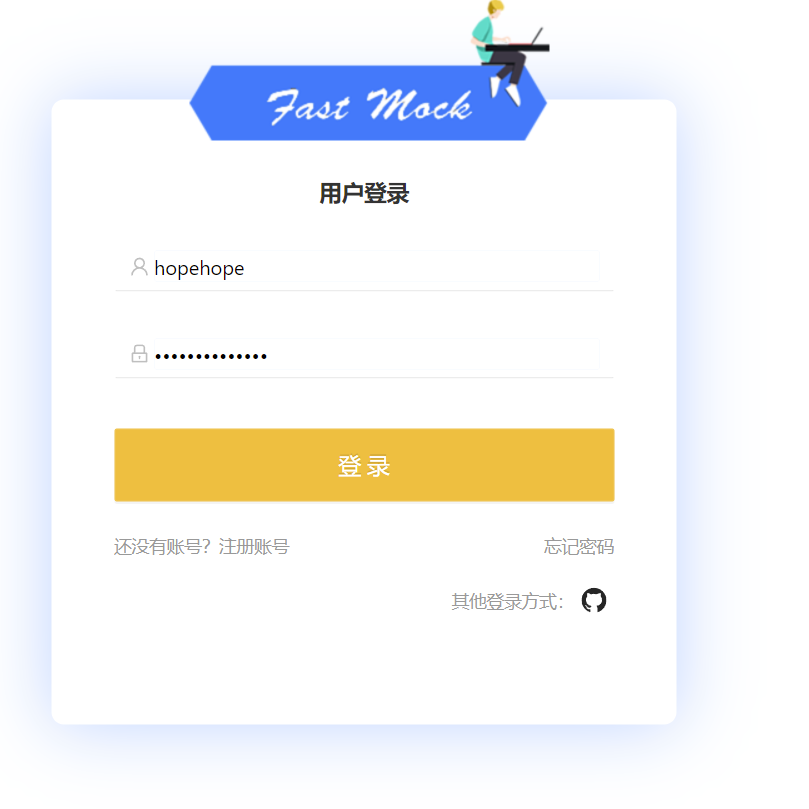
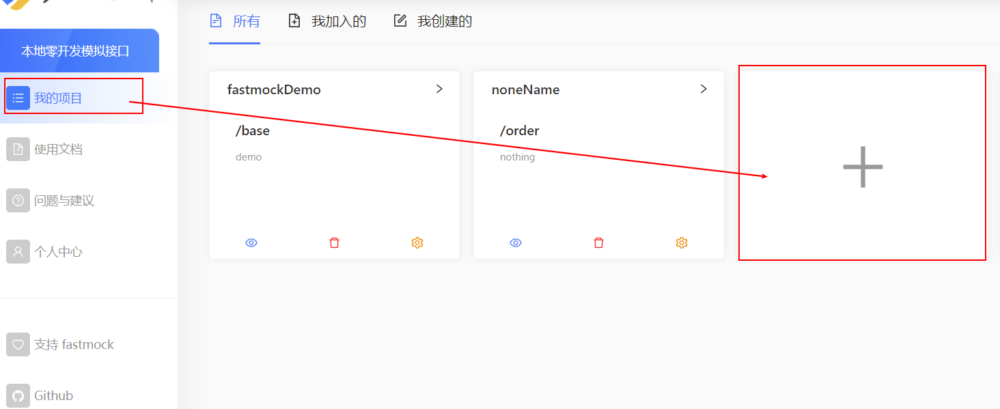
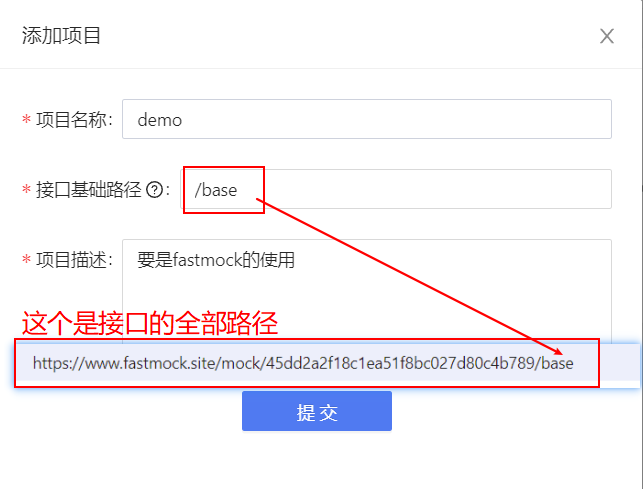
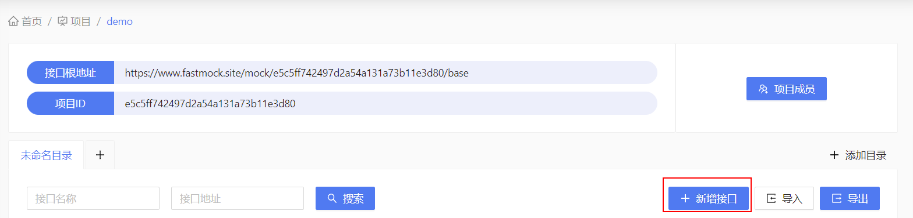
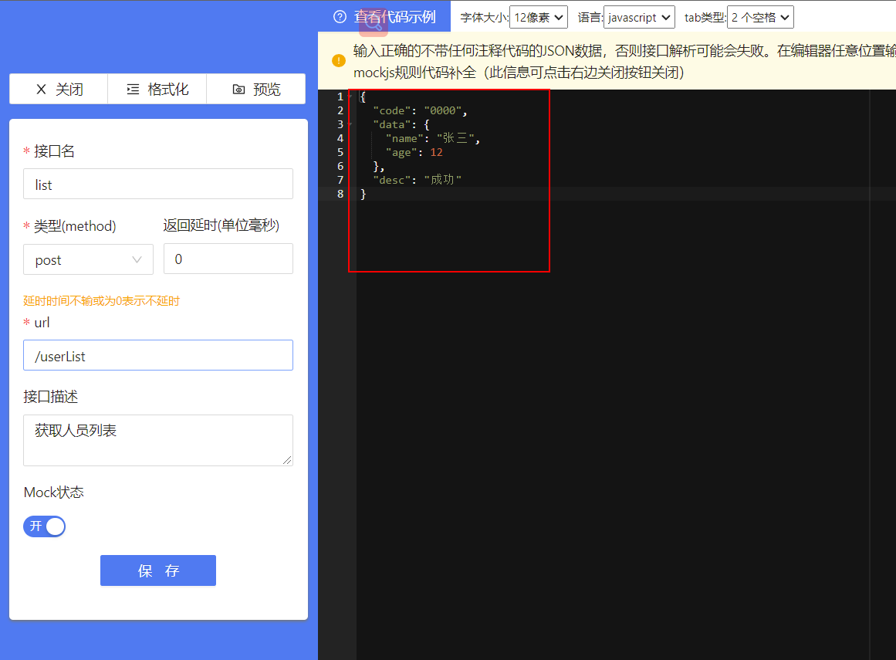
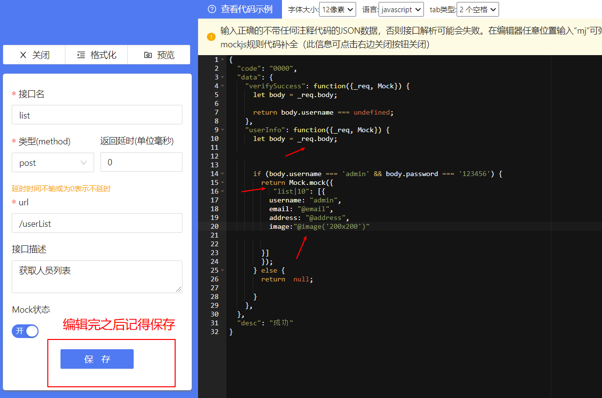
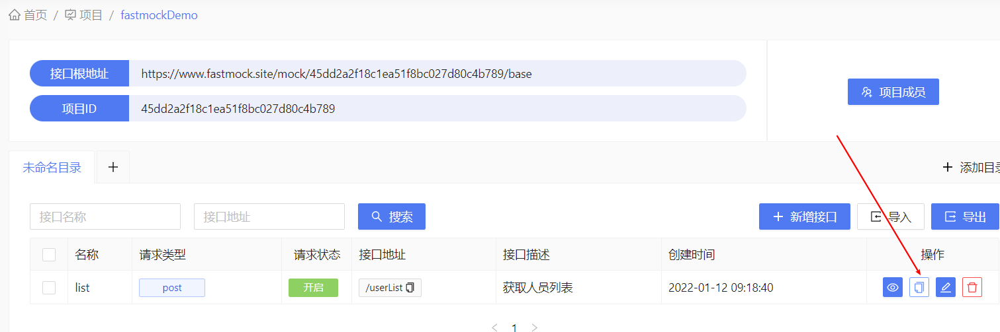
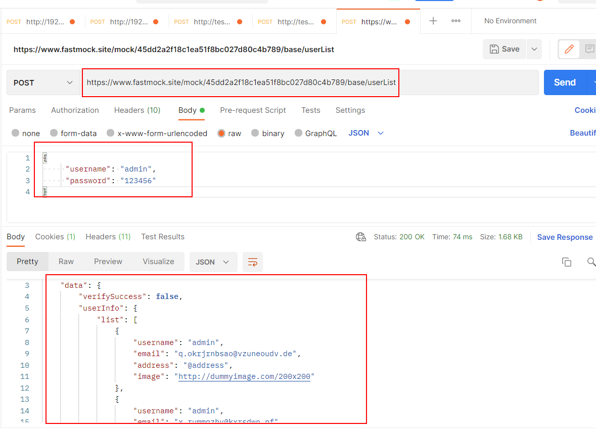

# fastmock介绍
  <!-- fastmock是一个在线网站，你可以在这个网站配置一个接口，然后你就可以把项目接口的路径改成这个就可以了，这样就可以不用依赖与后端的接口。
  Mock.js的原理：生成随机数据,拦截Ajax 请求 开始 前后端分离 让前端攻城师独立于后端进行开发。 增加单元测试的真实性 通过随机数据,模拟各种场景 -->
  - Mock.js的原理及背景
    - 生成随机数据,拦截Ajax 请求 开始 前后端分离 让前端攻城师独立于后端进行开发。 增加单元测试的真实性 通过随机数据,模拟各种场景
  - postMessage的使用
    -  fastmock是一个在线网站，你可以在这个网站配置一个接口，然后你就可以把项目接口的路径改成这个就可以了，这样就可以不用依赖与后端的接口。

    

### 第一步访问并注册网站
    网站网址:https://www.fastmock.site/#/,注册并登陆

### 第二步创建接口

  #### 点击我的项目创建一个接口
  
  #### 设置一个接口的想详细信息
  

### 第三步配置接口

 #### 点击新增接口
  
  #### 配置一个接口信息

  ##### 1.一个post请求  没有传参的接口

  

  
  ##### 2.一个post请求传参为{"username": "admin","password": "123456"}的接口

  

  <Badge text="配置代码的说明：" /> 

  - _req 如果是get请求，可以在_req.url中获取到，如果是post请求，可以在_req.body中获取到。
 - list|10 代表生成10个对象 
 - @email  代表每个访问随机生成一个email地址 
 - @image('200x200') 代表随机生成一个宽高200的图片
 - 更多内容介绍参考官方文档 http://mockjs.com/examples.html
       
### 第四步 利用postman使用接口
  #### 1.copy完整地址
  

  #### 2.done
  
    