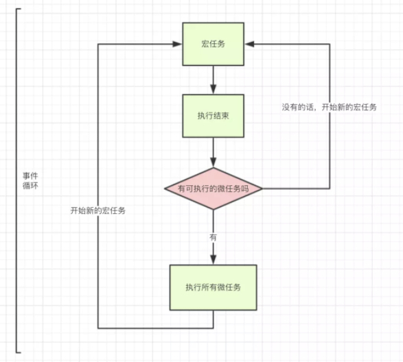

# 前端渲染速度优化方案

## 背景
- 行程首页首屏渲染速度慢，用户看到页面第一个元素等待时间过长
- 行程首页页签切换速度慢，用户点击完页签按钮之后，页面长时间处于假死状态，移动端和ie浏览器尤为突出。
- 为了解决上边的问题，我们分两部走，组件懒执行和组件懒加载,用于用到了事件循环，所以我们需要先了解什么事 js事件循环

## js事件循环
#### Event Loop(事件循环)中，每一次循环称为 tick, 每一次tick的任务如下：

- 执行栈选择最先进入队列的宏任务(通常是script整体代码)，如果有则执行
- 检查是否存在 Microtask，如果存在则不停的执行，直至清空 microtask 队列
- 更新render(每一次事件循环，浏览器都可能会去更新渲染)
- 重复以上步骤
宏任务 > 所有微任务 > 宏任务，如下图所示：

#### 宏任务与微任务:
 异步任务分为 宏任务（macrotask） 与 微任务 (microtask)，不同的API注册的任务会依次进入自身对应的队列中，然后等待 Event Loop 将它们依次压入执行栈中执行。

- 宏任务(macrotask)：

script(整体代码)、setTimeout、setInterval、UI 渲染、 I/O、postMessage、 MessageChannel、setImmediate(Node.js 环境)

- 微任务(microtask)：

Promise、 MutaionObserver、process.nextTick(Node.js环境）
#### demo
```javascript
  // 执行顺序问题，考察频率挺高的，先自己想答案**
    setTimeout(function () {
        console.log(1);
    });
    new Promise(function(resolve,reject){
        console.log(2)
        resolve(3)
    }).then(function(val){
        console.log(val);
    })
    console.log(4);
```
根据本文的解析，我们可以得到:

- 先执行script同步代码
- 先执行new Promise中的console.log(2),then后面的不执行属于微任务
- 然后执行console.log(4)

- 执行完script宏任务后，执行微任务，console.log(3)，没有其他微任务了。
- 执行另一个宏任务，定时器，console.log(1)。
根据本文的内容，可以很轻松，且有理有据的猜出写出正确答案：2,4,3,1.
## 组件懒执行
- 将一部分不需要在首屏立刻展示的页面子组件先不初始化，等用户主动通过点击滑动等操作来触发初始化，这样就可以缩短页面首屏的渲染时间。比如行程首页的 人员选择组件，时间选择组件，城市选择组件等都可以用组件懒执行方案来优化

***示例代码***
```javascript
<lazy-component :lazyInit="lazyConfig.initExceedApply">
	<exceed-apply>
	</exceed-apply>
</lazy-component>
```
## 组件懒加载
- 这一部分主要用到了js事件循环相关的知识。未优化之前，我们点击了页签切换，浏览器并不会立即执行点击事件对应的回调代码，而是将该回调推入到队列中，且等浏览器堆栈中的的js和微任务全部执行完（页面组件和所有子组件渲染完成），浏览器主栈空闲了，才会将该回调从队列中push出来执行。如果页面组件比较多，导致渲染页面花费很长时间，就会使点击之后等待较长时间才能切换页签。
- 优化思路： 将所有组件一起渲染的任务拆分成很多个小任务，且不能同时推入到浏览器的任务队列中。基于此考虑我们自建了一个队列用来搜集小任务，当页面组件渲染完成会从自建队列中取出第一个小任务推入到浏览器的任务队列中，第一次小任务执行完成后，会将自建队列的第二个小任务推入到浏览器任务队列中，以此类推。当点击页签，点击事件触发时，将点击事件的回调推入浏览器任务队列排队，同时清空自建队列中的小任务，这样页签点击的回调最多只需要等一个小任务的执行时间，如果这个小任务拆分的够细，那么等待的时间就会很短，优化效果就达到了。

***示例代码***
```javascript
<lazy-component :lazyLoad="true">
          <person-select>
		  </person-select>
</lazy-component>
```
## 代码架构，主要是lazyComponent组件和lazyControl类
- lazyControl封装了所有的针对自建队列的行为，如：开启自建队列中的任务，往自建队列添加任务，清空自建队列的任务。
- lazyComponent组件主要用来包裹需要优化的组件或者代码，这里会将包裹的组件封装成一个个任务放入自建队列中，同时，根据不同的lazyInit和lazyLoad参数， 将包裹的组件封装成懒加载组件或者懒执行组件。
## 注意事项
- 自建队列中的小任务是自启动的，不需要额外操作。
- 页面切换时，清空当前页面自建队列中所有的任务,代码如下
```javascript
this.$router.beforeEach((to, from, next) => {
        lazyControl.clearTask(this.$route, to.name);
        next();
      });
```
## 源码
- lazyComponent.vue文件代码
```vue
  <template>
  <div class="lazy-component" key="component">
    <template v-if="loading">
      <slot></slot>
    </template>
  </div>
</template>

<script lang="ts">
import "./less/style.scss";
import { Component, BaseComponent, Watch, Prop } from "@/base";
import LazyControl from "@/lib/lazyControl";
import { AnyObject } from "@/core/types";
const lazyControl = new LazyControl();
@Component({
  name: "lazyComponent"
})
export default class LazyComponent extends BaseComponent {
  appName = "common";
  // 懒执行 组件懒初始化
  @Prop({ type: Boolean, default: false })
  lazyInit!: boolean;
  // 懒加载
  @Prop({ type: Boolean, default: false })
  lazyLoad!: boolean;

  loading = false;

  @Watch("lazyInit")
  onLazyInit() {
    this.init();
  }

  // 处理组件和骨架组件的切换
  init() {
    if (this.lazyInit && !this.loading) {
      this.loading = true;
    } else if (this.lazyLoad && !this.loading) {
      const timer = setTimeout(() => {
        this.loading = true;
        this.taskObserve();
      }, 0);
      lazyControl.option.timer = timer;
    }
  }
  taskObserve() {
    if (window.MutationObserver) {
      const mutationObserver = new MutationObserver(this.intersectionHandler);
      lazyControl.option.observer = mutationObserver;
      mutationObserver.observe(this.$el, { childList: true });
    } else {
      // 不支持 MutationObserver 加载该组件的时候 立即通知下一个任务去排队
      lazyControl.option.observer = null;
      lazyControl.startTask();
    }
  }
  intersectionHandler(...args: AnyObject[]) {
    lazyControl.startTask();
    args[1].disconnect();
  }
  created() {
    if (this.lazyLoad && !this.loading) {
      // lazyControl.tasks.push({ fn: this.init, path: this.$route.path });
      lazyControl.addTask(this.init, this.$route.path);
    } else if (this.lazyInit && !this.loading) {
      this.init();
    }
  }
}
</script>

```
- lazyControl.ts 文件
```typescript
import { AnyObject } from "@/types";
import { Route } from "vue-router/types";
interface Task {
  path: string;
  fn: () => void;
}
interface LazyControl {
  tasks: Task[];
  option: {
    curTaskPath: string; // 当前任务的path
    observer: null | AnyObject; // 当前任务的 observer
    timer: number | null; // 当前任务的 timer
    status: string;
  };
}
class LazyControl {
  startTask() {
    if (this.tasks.length > 0) {
      this.tasks[0].fn();
      this.option.curTaskPath = this.tasks[0].path;
      this.tasks.shift();
      this.option.status = "pending";
    } else {
      // 当没有任务，进来时 则将 status 置为 "end"
      this.option.status = "end";
    }
  }
  addTask(fn: () => void, path: string) {
    this.tasks.push({ fn, path });
    if (this.tasks.length === 1 && this.option.status === "end") {
      // 第一次添加任务（任务数量为0且状态为 end ）
      this.startTask();
    }
  }
  clearTask(route: Route, toName: string) {
    const { tasks } = this;
    const len = tasks.length;
    for (let i = len - 1; i >= 0; i--) {
      if (this.isNeedClear(tasks[i].path, route, toName)) {
        // 离开当前页 之前，清除当前页的任务
        tasks.splice(i, 1);
      }
    }
    const { curTaskPath, observer, timer } = this.option;
    if (this.isNeedClear(curTaskPath, route, toName)) {
      // 当前排队的任务 属于 要离开页面的任务，需要终止定时器
      // this.option.curTaskPath = null;
      // if (window.webkitCancelRequestAnimationFrame) {
      //   timer && window.webkitCancelRequestAnimationFrame(timer);
      // } else {
      // }
      timer && clearTimeout(timer);
      this.option.timer = null;
      observer && observer.disconnect();
      this.option.observer = null;
    }
    if (this.tasks.length === 0) {
      // 一个任务都没有的时候，需要将状态置为 end。如果最后一次执行完，没有进来
      // status 一直为 pending, 则再次加任务 无法自动执行
      this.option.status = "end";
    }
  }
  isNeedClear(path: string, route: Route, toName: string) {
    const { curTaskPath } = this.option;
    // 当重复点击，离开的路由和 进入的路由 为同一个时 不清除
    if (
      this.isPageInPath(curTaskPath, route) &&
      !this.isPageInToName(toName, route)
    ) {
      return true;
    } else {
      return false;
    }
  }
  isPageInPath(path: string, route: Route) {
    const { matched } = route;
    return matched.some(item => item.path === path);
  }
  isPageInToName(name: string, route: Route) {
    const { matched } = route;
    return matched.some(item => item.name === name);
  }
}

LazyControl.prototype.tasks = []; // 保存所有任务{path:"", fn: ""}
LazyControl.prototype.option = {
  curTaskPath: "", // 当前任务的path
  observer: null, // 当前任务的 observer
  timer: 0, // 当前任务的 timer
  status: "end"
}; // "pending" "end"
export default LazyControl;

```
[lazyComponent.vue](http://note.youdao.com/noteshare?id=89adbd8e922c742a672a9980bffdc940&sub=64C7AB7383684E1BBC41489ABA1F1A7D)
[lazyControl.js](http://note.youdao.com/noteshare?id=840e915f6c8f0d2bf5eaa5aee6922faa&sub=18524E9AC8E44D5C8FF420915137F989)